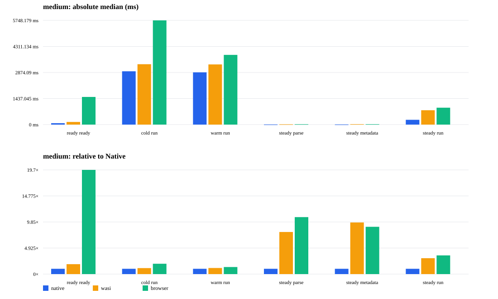

# wasm-fcs

`wasm-fcs` is a standalone repository that packages F# Compiler Services (FCS) for WASM execution environments. Any F# code can be handled through the same API from the following two environments.

- Browser WASM: a runtime that exposes `parse`, `metadata`, and `run` to JS / TS, plus a Playground
- WASI: a CLI that can be launched from Wasmtime. Provides both a file CLI and stdin JSON

## Structure

```text
wasm-fcs
├── nix/wasm-fcs.nix          # Pins FCS itself, its NuGet dependencies, and WASI patches into a single Nix package
├── src/WasmFcs.Core/         # FCS checker + syntax/symbol metadata + sandbox execution
├── src/WasmFcs.Wasi/         # wasi-wasm guest / CLI
├── src/WasmFcs.Browser/      # browser-wasm JS exports
├── browser/src/index.ts      # JS/TS facade
└── browser/index.html        # runnable Playground
```

WASI-specific changes to FCS are limited to `patches/wasm-fcs-async.patch` and `patches/wasm-fcs-hashing.patch`, and `nix/wasm-fcs.nix` owns the FCS source revision, NuGet dependencies, and patches together. The patches serialize compiler processing under WASI and replace thread-dependent cryptographic hashing with a portable non-cryptographic hash. The latter is used for FCS's internal cache keys / MVID purposes only and is not used for signing.

## Building with Nix

```sh
nix build .#wasm-fcs
nix build .#wasi-runtime
nix build .#browser-runtime
nix develop
```

If you need to use multiple artifacts at the same time, it's convenient to give them separate output names.

```sh
nix build .#wasm-fcs -o result-fcs
nix build .#wasi-runtime -o result-wasi
nix build .#browser-runtime -o browser/public/fcs-runtime
```

The artifact of the `wasm-fcs` package is `lib/FSharp.Compiler.Service.dll`. Both the WASI and Browser runtimes reference this as `WasmFcsPath` and do not fetch a separate FCS from NuGet.

## WASI CLI

```sh
cat > example.fsx <<'EOF'
printfn "hello from F#"
let answer = 40 + 2
printfn "answer = %d" answer
EOF

# Use the launcher from the Nix output (the launcher starts Wasmtime in the runtime directory)
result-wasi/run-wasm-fcs run example.fsx
result-wasi/run-wasm-fcs parse example.fsx
result-wasi/run-wasm-fcs metadata example.fsx
```

For programmatic calls, a single JSON value can be passed to stdout. The WASI guest's stdout is reserved for JSON only; the user code's `printfn` output is collected into the `output` field of the `run` result.

```sh
{ printf 'run\n'; cat example.fsx; } \
  | (cd result-wasi && wasmtime run -S http --dir . dotnet.wasm WasmFcs.Wasi)

# JSON requests are also accepted
printf '%s' '{"command":"run","source":"printfn \\"hello\\""}' \
  | (cd result-wasi && wasmtime run -S http --dir . dotnet.wasm WasmFcs.Wasi)
```

## Browser API and Playground

Generate the Browser runtime and start the Playground.

```sh
nix build .#browser-runtime -o browser/public/fcs-runtime
npm install --prefix browser
npm run dev --prefix browser
```

Browsers require cross-origin isolation via `COOP: same-origin` and `COEP: require-corp`. The Vite configuration sets these development headers.

```ts
import { createBrowserFcs } from "wasm-fcs-browser";

const fcs = await createBrowserFcs({ runtimeUrl: "/fcs-runtime" });
const parsed = await fcs.parse("let answer = 40 + 2");
const symbols = await fcs.metadata("let answer = 40 + 2");
const execution = await fcs.run('printfn "hello"');
```

Each operation returns a typed TS object instead of JSON. `diagnostics` returns FCS's `FSxxxx` diagnostics together with `FCSWxxxx` diagnostics (empty source, forbidden directives, sandbox capability rejections, etc.) in a common format.

### Manual installation of the facade package

The Browser facade is not published to the npm registry; it is generated as a GitHub Release tarball at release time. Download the corresponding `wasm-fcs-browser-facade-<version>.tgz` and install it locally.

```sh
npm install ./wasm-fcs-browser-facade-0.1.0.tgz
```

The WASM runtime is not included in the facade package. Fetch the corresponding `wasm-fcs-browser-runtime-<version>.tar.gz`, verify its checksum, and extract it into your app's static directory.

```sh
sha256sum -c wasm-fcs-browser-runtime-0.1.0.tar.gz.sha256
mkdir -p public/fcs-runtime
tar --extract --gzip \
  --file wasm-fcs-browser-runtime-0.1.0.tar.gz \
  --directory public/fcs-runtime
```

```ts
import { createBrowserFcs } from "wasm-fcs-browser";

const fcs = await createBrowserFcs({ runtimeUrl: "/fcs-runtime" });
```

`runtimeUrl` is the directory that serves the extracted runtime; it is not the GitHub Release archive URL. Page delivery requires `Cross-Origin-Opener-Policy: same-origin` and `Cross-Origin-Embedder-Policy: require-corp`.

## Sandbox boundary

FCS is a compiler, not a runtime safety boundary. Therefore, before execution it rejects the following based on FCS symbol use, and additionally relies on host-side WASI / Browser capabilities.

- `System.IO`, `System.Net`, `System.Reflection`, `System.Diagnostics`, `System.Environment`
- native interop, assembly loaders, expression compilers, F# native/reflection escapes
- `#r`, `#load`, `#I`, `#line`

The only host directory exposed at WASI runtime is `--dir .`, used by the CLI itself to read the input file. Do not grant user code a writable directory or network capability. Execution is serialized; if you need to run multiple sources within the same process, regenerate the runtime on the host side as needed.

## FCS performance comparison

Native .NET, WASI / Wasmtime, and Browser WASM are compared using the same FCS, reference assemblies, and workload. Run the benchmarks inside `nix develop`.

```sh
nix build .#wasi-runtime -o result-wasi
nix build .#browser-runtime -o result-browser
nix build .#wasm-fcs -o result-fcs
dotnet build bench/WasmFcs.BenchHost/WasmFcs.BenchHost.csproj -c Release

WASM_FCS_DLL="$PWD/result-fcs/lib/FSharp.Compiler.Service.dll" \
WASM_FCS_RUNTIME="$PWD/result-wasi" \
node tools/benchmark.mjs > /tmp/fcs-native-wasi.ndjson

WASM_FCS_RUNTIME="$PWD/result-wasi" \
node tools/benchmark-browser.mjs > /tmp/fcs-browser.ndjson

node tools/render-benchmark.mjs /tmp/fcs-native-wasi.ndjson /tmp/fcs-browser.ndjson
```

`BENCH_ITERATIONS` is the default number of steady-state runs (10); `BENCH_COLD_ITERATIONS` and `BENCH_WARM_ITERATIONS` are the default number of measurements that create a new process/page (3). For rigorous cold-start comparisons, set these values to 10 or more.

<!-- BENCHMARK-REPORT-START -->
### Measurement conditions

- Terminology: `cold` is the time from a fresh process/runtime to the first operation completing, `warm` is an unprocessed source after FCS is ready, and `steady` is the same source repeated after one warm-up.
- Table values are the median and p95 (`median / p95`) of the elapsed time as observed from the host. p95 is omitted when the sample count is below 10.
- The Native ratio is computed as the Native median for the same workload/scenario/operation equal to 1.00×.
- Both `parse` and `metadata` include `ParseAndCheckFileInProject`. `run` includes parsing, compiling, assembly loading, and executing startup code.
- Browser's `ready` / `cold` include Chromium process startup and page load, but not preview server startup time.
- Reference assembly count: 10. All workloads are single files.

#### Absolute time (ms)

| workload / scenario / operation | Native | WASI | Browser |
| --- | ---: | ---: | ---: |
| small / ready / ready | 80.240 ms / — (n=3) | 157.129 ms / — (n=3) | 1801.787 ms / — (n=3) |
| small / cold / parse | 2060.990 ms / — (n=3) | 1976.120 ms / — (n=3) | 3798.150 ms / — (n=3) |
| small / cold / metadata | 2018.434 ms / — (n=3) | 2022.465 ms / — (n=3) | 3788.726 ms / — (n=3) |
| small / cold / run | 2999.307 ms / — (n=3) | 3013.251 ms / — (n=3) | 5399.535 ms / — (n=3) |
| small / warm / parse | 1951.340 ms / — (n=3) | 1736.724 ms / — (n=3) | 2160.680 ms / — (n=3) |
| small / warm / metadata | 1899.370 ms / — (n=3) | 1797.377 ms / — (n=3) | 2124.160 ms / — (n=3) |
| small / warm / run | 2789.530 ms / — (n=3) | 2842.822 ms / — (n=3) | 3374.995 ms / — (n=3) |
| small / steady / parse | 0.398 ms / 11.320 ms (n=10) | 2.372 ms / 26.765 ms (n=10) | 3.580 ms / 26.480 ms (n=10) |
| small / steady / metadata | 0.447 ms / 12.777 ms (n=10) | 3.189 ms / 16.632 ms (n=10) | 4.623 ms / 27.120 ms (n=10) |
| small / steady / run | 194.822 ms / 262.493 ms (n=10) | 647.925 ms / 692.263 ms (n=10) | 688.555 ms / 935.240 ms (n=10) |
| medium / ready / ready | 77.418 ms / — (n=3) | 145.173 ms / — (n=3) | 1525.113 ms / — (n=3) |
| medium / cold / parse | 1995.622 ms / — (n=3) | 2107.582 ms / — (n=3) | 3866.251 ms / — (n=3) |
| medium / cold / metadata | 1960.566 ms / — (n=3) | 2107.743 ms / — (n=3) | 3833.954 ms / — (n=3) |
| medium / cold / run | 2940.566 ms / — (n=3) | 3330.635 ms / — (n=3) | 5748.179 ms / — (n=3) |
| medium / warm / parse | 1895.650 ms / — (n=3) | 1902.780 ms / — (n=3) | 2604.380 ms / — (n=3) |
| medium / warm / metadata | 1893.430 ms / — (n=3) | 1958.517 ms / — (n=3) | 2556.780 ms / — (n=3) |
| medium / warm / run | 2882.009 ms / — (n=3) | 3318.816 ms / — (n=3) | 3844.960 ms / — (n=3) |
| medium / steady / parse | 1.838 ms / 12.988 ms (n=10) | 14.628 ms / 33.587 ms (n=10) | 19.797 ms / 61.495 ms (n=10) |
| medium / steady / metadata | 2.366 ms / 23.749 ms (n=10) | 23.086 ms / 44.476 ms (n=10) | 21.152 ms / 62.990 ms (n=10) |
| medium / steady / run | 263.651 ms / 316.079 ms (n=10) | 792.074 ms / 859.088 ms (n=10) | 931.855 ms / 1039.590 ms (n=10) |
| large / ready / ready | 75.901 ms / — (n=3) | 142.167 ms / — (n=3) | 2011.671 ms / — (n=3) |
| large / cold / parse | 2187.956 ms / — (n=3) | 2899.683 ms / — (n=3) | 5738.000 ms / — (n=3) |
| large / cold / metadata | 2121.879 ms / — (n=3) | 2965.430 ms / — (n=3) | 5520.114 ms / — (n=3) |
| large / cold / run | 3567.374 ms / — (n=3) | 5423.036 ms / — (n=3) | 8763.139 ms / — (n=3) |
| large / warm / parse | 2043.860 ms / — (n=3) | 2855.254 ms / — (n=3) | 4000.915 ms / — (n=3) |
| large / warm / metadata | 1998.443 ms / — (n=3) | 2796.635 ms / — (n=3) | 3785.030 ms / — (n=3) |
| large / warm / run | 3265.540 ms / — (n=3) | 5177.690 ms / — (n=3) | 6271.290 ms / — (n=3) |
| large / steady / parse | 16.392 ms / 29.967 ms (n=10) | 70.370 ms / 83.375 ms (n=10) | 70.070 ms / — (n=3) |
| large / steady / metadata | 22.627 ms / 34.792 ms (n=10) | 128.388 ms / 144.683 ms (n=10) | 83.310 ms / — (n=3) |
| large / steady / run | 426.214 ms / 574.246 ms (n=10) | 1777.040 ms / 1859.445 ms (n=10) | 1894.070 ms / — (n=3) |

#### Ratio to Native

| workload / scenario / operation | Native | WASI | Browser |
| --- | ---: | ---: | ---: |
| small / ready / ready | 1.00× | 1.96× | 22.45× |
| small / cold / parse | 1.00× | 0.96× | 1.84× |
| small / cold / metadata | 1.00× | 1.00× | 1.88× |
| small / cold / run | 1.00× | 1.00× | 1.80× |
| small / warm / parse | 1.00× | 0.89× | 1.11× |
| small / warm / metadata | 1.00× | 0.95× | 1.12× |
| small / warm / run | 1.00× | 1.02× | 1.21× |
| small / steady / parse | 1.00× | 5.96× | 8.99× |
| small / steady / metadata | 1.00× | 7.13× | 10.34× |
| small / steady / run | 1.00× | 3.33× | 3.53× |
| medium / ready / ready | 1.00× | 1.88× | 19.70× |
| medium / cold / parse | 1.00× | 1.06× | 1.94× |
| medium / cold / metadata | 1.00× | 1.07× | 1.96× |
| medium / cold / run | 1.00× | 1.13× | 1.96× |
| medium / warm / parse | 1.00× | 1.00× | 1.37× |
| medium / warm / metadata | 1.00× | 1.03× | 1.35× |
| medium / warm / run | 1.00× | 1.15× | 1.33× |
| medium / steady / parse | 1.00× | 7.96× | 10.77× |
| medium / steady / metadata | 1.00× | 9.76× | 8.94× |
| medium / steady / run | 1.00× | 3.00× | 3.53× |
| large / ready / ready | 1.00× | 1.87× | 26.50× |
| large / cold / parse | 1.00× | 1.32× | 2.62× |
| large / cold / metadata | 1.00× | 1.40× | 2.60× |
| large / cold / run | 1.00× | 1.52× | 2.46× |
| large / warm / parse | 1.00× | 1.40× | 1.96× |
| large / warm / metadata | 1.00× | 1.40× | 1.89× |
| large / warm / run | 1.00× | 1.59× | 1.92× |
| large / steady / parse | 1.00× | 4.29× | 4.28× |
| large / steady / metadata | 1.00× | 5.67× | 3.68× |
| large / steady / run | 1.00× | 4.17× | 4.44× |

#### FCS internal phases (medium / steady / run)

| medium / steady inner phase | Native | WASI | Browser |
| --- | ---: | ---: | ---: |
| parseAndCheckMs | 0.121 ms | 0.368 ms | 1.175 ms |
| symbolExtractionMs | 1.703 ms | 8.646 ms | 10.390 ms |
| compileMs | 259.630 ms | 776.483 ms | 903.125 ms |
| loadAndExecuteMs | 0.508 ms | 0.659 ms | 1.322 ms |



Generated: 2026-08-22T18:27:56.641Z
<!-- BENCHMARK-REPORT-END -->

## License

MIT

The original code is licensed under MIT. Third-party runtime, compiler, and
build components retain their upstream licenses; see
[`THIRD-PARTY-NOTICES.md`](THIRD-PARTY-NOTICES.md).
